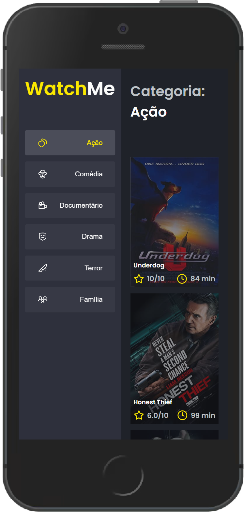

# WatchMe

## ℹ Descrição

Projeto desenvolvido no desafio complementar do capítulo 1 do Ignite.

O desafio consistia em componentizar a aplicação. Toda a interface e a lógica do projeto foram divididas em componentes Content e SideBar, sendo que estavam concentrado no arquivo App.tsx.

WatchMe é um app que exibe uma lista de filmes e documentários de acordo com a categoria que foi selecionado, como filmes de ação, comédia e drama.

## ⚒ Tecnologias

- React
- Typescript
- SCSS
- Axios
- Json-server

## ⚙ Pré-requisitos

- <a href="https://git-scm.com/" target="_blank">Git</a>
- <a href="https://yarnpkg.com/" target="_blank">Yarn</a>
- Editor de código

## 🖥 Como usar

- `git clone https://github.com/EduardoReisUX/desafio02-trilha-reactjs.git` para clonar este repositório;
- `cd desafio02-trilha-reactjs`
- `yarn install` para instalar as dependências;
- `yarn server` para subir um server do json-server;
- `yarn dev` para desenvolvimento;

## 👀 Espiadinha

</img>
